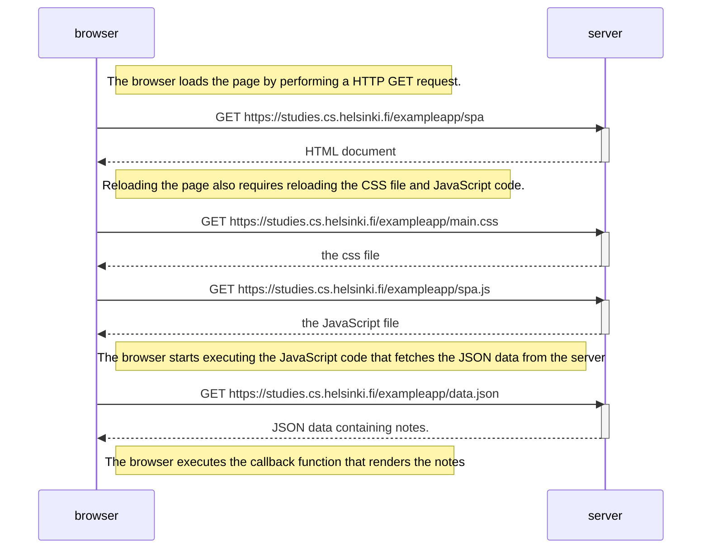

# 0.5 Single page app diagram

The diagram below depicts the sequence of steps that take place when loading the Single page app version of the notes webpage. She steps should be identical to the steps taken when loading the other notes webpage, but a different HTML file and JavaScript code file is loaded (spa.js).

