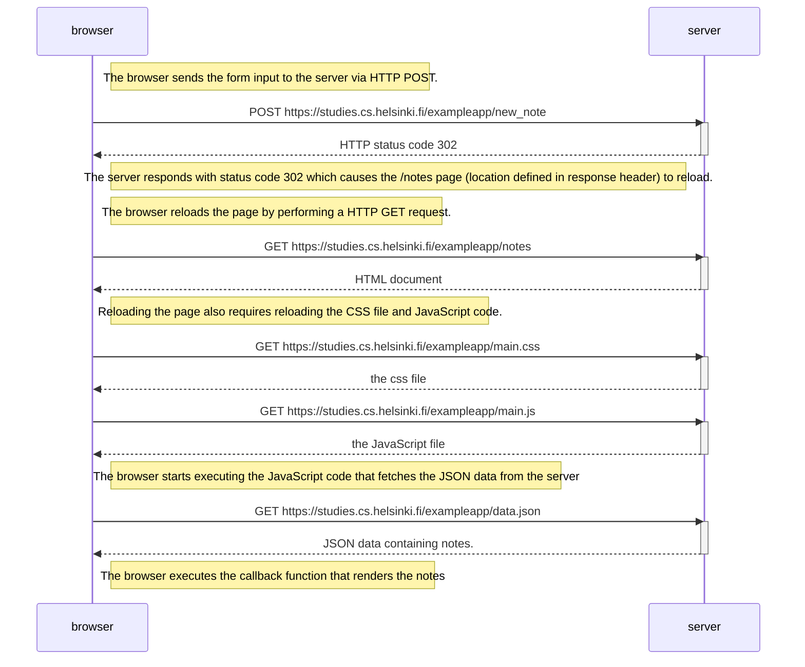

# 0.4 New note diagram

The diagram below depicts the sequence of steps that take place when creating a new note on the notes webpage.

```mermaid

sequenceDiagram
    participant browser
    participant server

    Note right of browser: The browser sends the form input to the server via HTTP POST.

    browser->>server: POST https://studies.cs.helsinki.fi/exampleapp/new_note
    activate server
    server-->>browser: HTTP status code 302
    deactivate server

    Note left of server: The server responds with status code 302 which causes the /notes page (location defined in response header) to reload.

    Note right of browser: The browser reloads the page by performing a HTTP GET request.

    browser->>server: GET https://studies.cs.helsinki.fi/exampleapp/notes
    activate server
    server-->>browser: HTML document
    deactivate server

    Note right of browser: Reloading the page also requires reloading the CSS file and JavaScript code.

    browser->>server: GET https://studies.cs.helsinki.fi/exampleapp/main.css
    activate server
    server-->>browser: the css file
    deactivate server

    browser->>server: GET https://studies.cs.helsinki.fi/exampleapp/main.js
    activate server
    server-->>browser: the JavaScript file
    deactivate server

    Note right of browser: The browser starts executing the JavaScript code that fetches the JSON data from the server

    browser->>server: GET https://studies.cs.helsinki.fi/exampleapp/data.json
    activate server
    server-->>browser: JSON data containing notes.
    deactivate server

    Note right of browser: The browser executes the callback function that renders the notes

```

